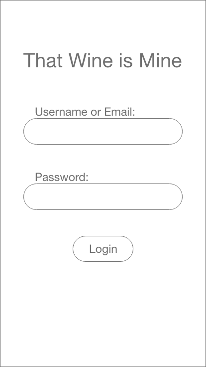
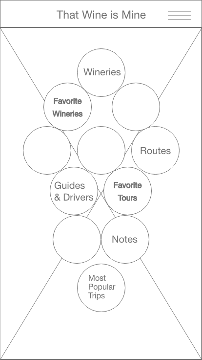
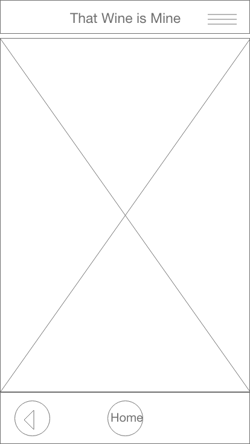
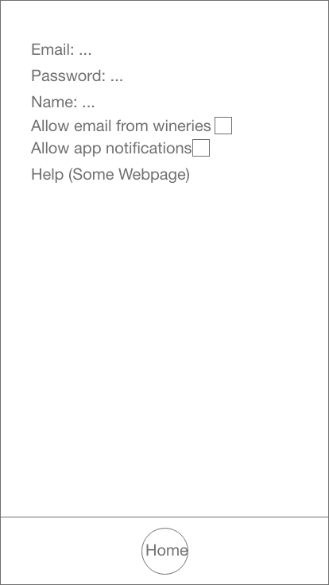
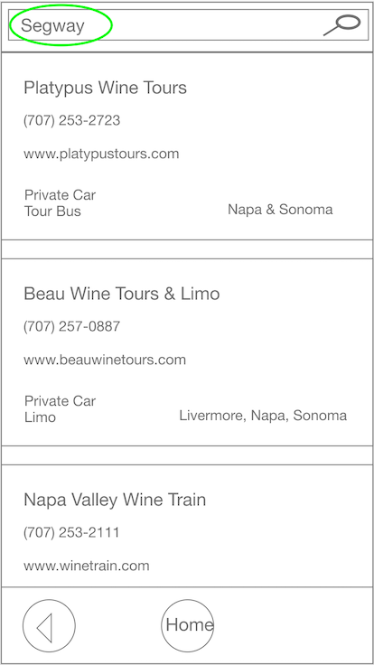

# Phase 2: Interaction Design

* Team: That Wine is Mine
* Contributors: Carlson Smith, Nathan Tisdale, and Teng Xiong

# Executive Summary

* Using the information and research that we got in phase 1, we planned out an app with __wireframes__.
* The wireframes were stitched together to develop an interactive prototype on __AdobeXD__
  * We attempted to illustrate each interaction, but some interactions have limited implementation in the prototype; the *heart icon for favorites can be interacted on the Winery Details screen*
* The overall design of our prototype/wireframe came from the *personas* and *scenarios*
  * __Lauren__, __Sally__ and __John's__ needs were considered for all steps
* __Safety__, __efficiency__, __effectiveness__, __memorability__, __usefulness__, __learnability__, __error tolerance__, and __satisfaction__ kept in mind in the design of these wire frames and the flow of the prototype
* The search feature is an example of maximizing flexibility for the users where they can *__search on keywords__*

# Wireframe

## Login

Description: 

Having an account to save all the users data, including favorite wines, wineries, and trips was considered important for efficiency, effectiveness, usefulness and user satisfaction. The login page will be used for users to authenticate their username and password and enable their information to be saved.  This is especially important for John who can store wine notes, but can also be beneficial to the other personas.  This feature provides fault tolerance as data is stored in cloud.

## Home 

Description: 

The Home page is a central location for accessing our main features of the app.  The memorable design represents a grape vine cluster on a vine, with buttons that access the rest of the app in place, or on top of, berries.  You can access the settings from here in the top right corner hamburger bar.  The inspiration for this idea is to keep it simple for new users, but also show the options that older users might like.  Though the button ordering is scattered to also make all users at least scan the options and think about what they might want to do.

## Route List

Description: 

A list of all the routes to each winery will provides a means to browse and search all registered wineries. Sometimes you want to find the nearest winery to visit, so this will be a great help to determine which winery is closer to where you are at the moment.  A sort option can be accessed in the hamburger menu for users to sort on rating.  Sally will benefit from the efficiency of being able to search for a route with the plain text search.

## Winery List

Description: 

John will benefit the most from the winery list, especially the ability to search for a winery using plain text.  The text search capability gives John an efficient way to lookup a winery.  Sally and Lauren might use the list to browse, but mostly to find a winery recommended by friends.  

## Winery Detail

Description: 

The wine club link will be helpful to John so he can later sign up for a wine club after he gets back from a tasting trip.  The pricing information is updated dynamically from feeds received from the partner wineries.  Sally and Lauren will enjoy the satisfaction of learning about different wineries.

### Winery Detail (*Deselecting Favorite*)

Description: 

The heart icon on the winery details page is functional in this prototype.  This transition page illustrates the behavior that can be expected everywhere this icon is selected and deselected.  An empty heart indicates the item has not been selected as a favorite.  A filled heart indicates the item has been selected as a favorite.

## Wine Detail

Description: 

The wine detail provides a reference for all the personas to key information about the wine.  Clicking on the wine label thumbnail will zoom in on the label to help with recognition.

## Wine Detail Zoom

Description: 

Label recognition will be especially helpful to Sally and Lauren as they try to find wines from their trip in their local markets.  We hope for this to be a memorable feature that Lauren and Sally will find useful.

## Tasting Notes Detail

Description:

The tasting notes feature is a must have for John who likes to keep detailed notes on all wines he tastes.  Being able to quickly create/edit a note makes this feature learnable for Sally and Lauren as they learn more about wine and do more tastings.

## Tour Details

Description:

The tour details is a list of each winery that is included in the tour set.  List of winery cards of wines in tour showing winery name, region, tasting fee, hours, community rating, favorite status, map image.  We chose to provide a list of cards here, and in other screens, as this is a design used by many other apps and will help with learnability.

## Guide & Drivers

Description:

This page is meant for users who dont have a designated driver for their tour.  The inspiration for this page is really just safety for all of our users, a reminder to not drink and drive.  It provides known tour vans or buses that can be hired out.

## Favorite Tours

Description: 

A list of the trips/tours a user has saved for later reference.  This is an effective tool for Lauren and Sally to explore and pick a tour.

## Favorite Wineries

Description:

This screen lists the wineries that the user has favorited.  We expect every persona to find this feature useful.  Sally and Lauren may also find satisfaction in their list of favorites as a collection of tasting destinations which they have visited.

## Favorite Wines

Description: 

User tasting wine can efficiently mark it as a favorite as they enter tasting notes by selecting the heart icon.  The heart icon is unfilled until the user selects it to mark the items as a favorite.  This is a common design which should help with learnability.  This list helps the user keep track of wines they enjoy so they to use while shopping or planning their next trip.  This is most useful for the more experienced users like John, but Sally and Lauren will find it helpful as well.

## Note List

Description: 

The notes list feature will be most useful to John who likes to keep detailed notes on all wines he tastes.  The ability to search the notes list will help him efficiently and effectively find wines he has tasted in the past.  The fault tolerance provided by our cloud storage provides John peace of mind in the event he loses his device.

## Navigation

Description: 

The navigation is used in guiding a user to a winery, or in the case of a route, a series of wineries.  Google Maps is embedded to provide the most up to date maps and a learnable GPS interface.  The continuous updates of maps by Google helps support the safety of users in avoiding routes that are no longer valid.  The effectiveness of traffic information should also be a satisfying and useful feature.

## Most Popular Trips

Description: 

Lauren and Sally will both benefit from the list of most popular trips.  Lauren is unfamiliar with all of the options, so this will allow her to feel confident in selecting a highly rated trip.  Sally will save time in planning a trip with her friends by searching trips using the particular features she wants in the plain text search bar.

## Settings

Description: 

After a user is registered, the user can change their password, user name and email address on the settings screen, which is accessible from the home screen. Users may also opt in to email from wineries about new wines, special events and promotions.  After opting in, a user may disable this option at any time to unsubscribe from all mailings from our partner wineries.  We strive to guard the safety and privacy of our users by managing these communications on behalf of our partner wineries and never share user data.

## Search

Description:

Search is accessible from the top navigation bar on screens where personas may desire to search or filter lists.
* When searching for a tour company Sally can search for 'Segway' when planning that special outing with friends to tour on segways
* Lauren can search tours by rating, by simply entering '*****' to find the best tours

# Scenario Art Boards

## An example of Sally using That Wine is Mine

## An example of Lauren using That Wine is Mine

# Supplementary Material

[Wireframes](artboards)

[Prototype Draft](https://xd.adobe.com/view/323067db-e312-4884-b085-24a4b22cab8a-6763/)

